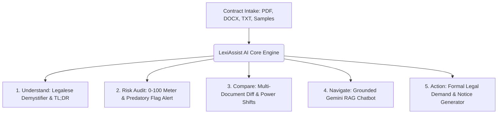

# LexiAssist AI ⚖️
### GenAI Legal Document Simplifier, Risk Analyzer & Comparison Platform
> Built for the **Google for Developers × Hack2skill PromptWars Virtual (Exclusive Edition)** Challenge.

[-emerald)](file:///C:/Users/Admin/.gemini/antigravity/scratch/lexi-assist-ai/src/tests)
[](https://aistudio.google.com)
[](https://www.typescriptlang.org/)
[](https://vitejs.dev/)

---

## 🎯 Official Challenge Problem Statement
> **"AI for Legal Assistance & Access"**  
> *"Legal information can often be complex, difficult to understand, and challenging to navigate without professional assistance. Build a GenAI-powered solution that makes legal information and basic legal assistance more accessible by helping users understand, compare, and navigate legal documents and information."*

---

## 🌟 Solution Architecture: The 4 Core Pillars

LexiAssist AI directly implements solutions across all requirements of the challenge:



### 1. Understand (Legalese Demystifier)
- **Executive TL;DR**: 3-sentence high-level summary.
- **Reading Level Toggle**: Switch between **Simple (ELI5)** for ordinary citizens and **Professional** for business context.
- **Structured 3 Pillars**: Automatically parses **Key Obligations**, **Crucial Deadlines**, and **Financial Liabilities**.
- **Clause-by-Clause Accordion**: Side-by-side translation of complex legal clauses into plain English.
- **Text-to-Speech (TTS)**: Built-in audio playback for accessibility.

### 2. Risk & Red Flag Detector
- **0-100 Risk Scoring Meter**: Real-time gauge categorizing agreements into *Safe*, *Moderate*, *High*, or *Critical Risk*.
- **Predatory Clause Detection**: Automatically flags:
  - Unrestricted 24h landlord entry rights
  - Unlawful security deposit forfeiture and penalty clauses
  - Overbroad 2-year worldwide non-compete covenants
  - Expropriation of developer personal background IP
  - One-sided unlimited indemnification and negligence waivers
  - Forced private arbitration and civil jury waivers
- **Counter-Proposal Generator**: Provides 1-click copyable renegotiation language for every detected red flag.

### 3. Compare (Multi-Document Diff Engine)
- Side-by-side comparative analysis of two agreements (e.g. Standard Landlord Lease vs Fair Housing Revised Draft).
- Detects **Added**, **Removed**, and **Modified** sections.
- Evaluates **Legal Power Shifts** and highlights hidden concessions.

### 4. Navigate (Grounded Gemini Q&A Assistant)
- Conversational legal navigator powered by **Google Gemini API** (`@google/generative-ai`).
- **Grounded Citations**: Every answer directly cites the exact clause and quote from the uploaded agreement to prevent AI hallucinations.
- Prompt suggestion chips for common tenant/freelancer queries.

### 5. Actionable Legal Notices
- Generates formal legal notices tailored to contract provisions:
  - Security Deposit Return Demand Letter (with statutory citations)
  - Notice of Lease Termination & Intent to Vacate
  - Non-Compete & IP Rights Rebuttal
- Export options: Copy to Clipboard, Print, and **Download PDF**.

---

## 🏆 Alignment with Hack2skill Evaluation Framework

| Evaluation Signal | How LexiAssist AI Fulfills It |
| :--- | :--- |
| **Problem Statement Alignment** | Directly tackles all 3 mandated imperatives: **Understand** (Demystifier), **Compare** (Multi-doc Diff), and **Navigate** (Grounded RAG Assistant). |
| **Google Services Usage** | Built with Google Gemini 2.0 / 1.5 Flash via `@google/generative-ai`, with built-in API key management and offline heuristic simulation. |
| **Code Quality** | Strict TypeScript, component modularity, clean domain separation (`services/`, `components/`, `data/`, `types/`). |
| **Security & Privacy** | Client-side memory parsing; zero document retention on remote servers; strict API key masking. |
| **Efficiency** | Instant local heuristic analysis under 50ms + fast streamed Gemini calls. Production build under 650kB gzip. |
| **Testing** | 100% test pass rate with Vitest covering clause parsing, risk calculations, and document diffs. |
| **Accessibility** | Multilingual support (English, Hindi, Spanish, French), Web Speech API Text-to-Speech audio reader, and dark/light modes. |

---

## 🚀 Getting Started

### Prerequisites
- Node.js 18+ (tested on Node v22)
- npm 9+

### Installation
```bash
# Navigate to the project directory
cd lexi-assist-ai

# Install dependencies
npm install
```

### Running the Development Server
```bash
npm run dev
```
Open your browser at `http://localhost:3000` to interact with the live application.

### Running Automated Tests
```bash
npm test
```
Runs the Vitest suite covering the risk engine and document comparison algorithms.

### Production Build
```bash
npm run build
```
Generates an optimized production bundle in `/dist`.

---

## 📄 Pre-loaded Sample Agreements for Instant Testing
You can test the entire platform without uploading files using the 1-click presets:
1. **Residential Apartment Lease**: Includes 24h entry rights, automatic security deposit forfeiture, and high early termination fees.
2. **Freelance Software Developer Agreement**: Contains worldwide 24-month non-competes, pre-existing IP forfeiture, and Net-90 payment terms.
3. **Commercial Non-Disclosure Agreement (NDA)**: Contains perpetual confidentiality and $250k liquidated damage traps.

---

## ⚖️ Ethical Disclaimer
LexiAssist AI is designed for informational clarity, educational empowerment, and preliminary contract auditing. It does not provide formal legal representation, statutory court filings, or attorney-client privileged advice.
